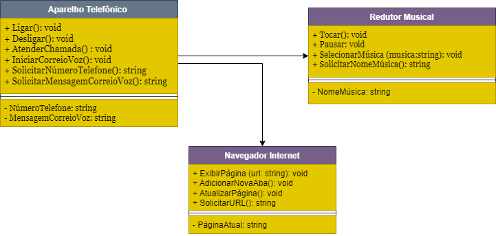

# Diagramação de Classes do iPhone

O projeto consiste na implementação de um aplicativo de smartphone em Java, que simula as funcionalidades básicas de um smartphone, como reprodução de música, navegação na internet e realização de chamadas telefônicas. Para isso, foram criadas três classes principais: RedutorMusical, NavegadorInternet e AparelhoTelefonico/Iphone, cada uma representando uma funcionalidade específica do smartphone.

A classe RedutorMusical permite selecionar e reproduzir músicas, pausá-las e obter informações sobre a música atual. A classe NavegadorInternet oferece recursos para exibir páginas da web e adicionar novas abas de navegação. Por fim, a classe AparelhoTelefonico possibilita a realização de chamadas telefônicas e o acesso ao correio de voz.

Além disso, foi criada a classe Smartphone que serve como uma interface para interagir com essas funcionalidades. Ela possui métodos para reproduzir música, navegar na internet e fazer chamadas telefônicas, utilizando as funcionalidades fornecidas pelas outras classes.

O projeto foi organizado em pacotes para melhorar a estrutura do código e facilitar a manutenção. Foram utilizadas anotações como @SuppressWarnings("unused") para suprimir avisos relacionados a variáveis ou métodos não utilizados.

Por fim, um método main() foi implementado na classe Smartphone para demonstrar o funcionamento básico do aplicativo, realizando uma sequência de ações simulando o uso do smartphone.

Diagrama em UML

